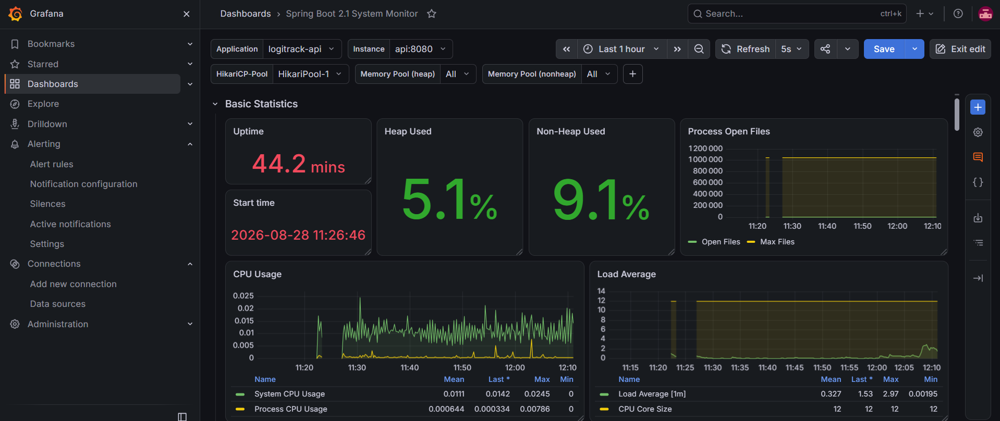
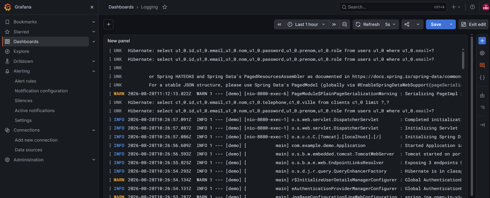
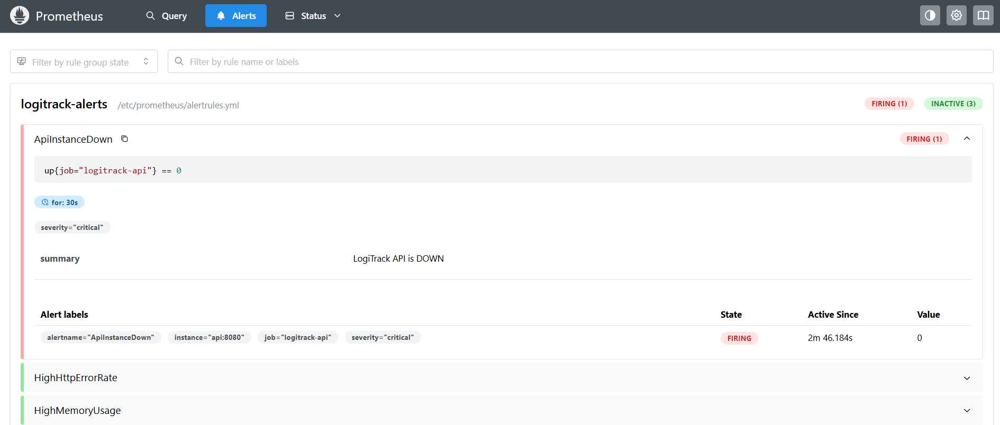

# 🚚 LogiTrack — API REST de Gestion Logistique

> API REST de gestion des clients, produits et commandes développée avec Spring Boot, Spring Data JPA et MySQL.

---

## 1. Présentation du projet

**LogiTrack** est une API REST développée pour gérer les opérations logistiques entre les clients et l'entrepôt.

L'application permet de gérer les clients, les produits, les commandes et les lignes de commande à travers des endpoints REST.

La deuxième partie du projet intègre également **Spring Security et JWT** afin de sécuriser l'accès à l'API et de gérer les autorisations selon les rôles des utilisateurs.

L'objectif principal est de proposer une API structurée, sécurisée et maintenable pour faciliter la gestion des opérations logistiques.

---

## 2. Problématique

La gestion des clients, des produits et des commandes peut devenir complexe lorsque les informations sont dispersées ou traitées manuellement.

LogiTrack propose une solution centralisée permettant de gérer ces informations à travers une API REST.

La sécurisation des accès permet également de protéger les données et de contrôler les fonctionnalités accessibles aux différents utilisateurs.

---

## 3. Fonctionnalités principales

### Gestion des clients

* Ajouter un client
* Afficher tous les clients
* Consulter un client par son identifiant
* Supprimer un client

### Gestion des produits

* Ajouter un produit
* Afficher tous les produits
* Consulter un produit par son identifiant
* Supprimer un produit
* Rechercher les produits par catégorie
* Rechercher les produits selon leur prix
* Afficher les produits avec un stock faible

### Gestion des commandes

* Créer une commande pour un client
* Ajouter un produit à une commande
* Afficher toutes les commandes
* Consulter une commande par son identifiant
* Rechercher les commandes d'un client
* Modifier le statut d'une commande
* Consulter le nombre total de commandes
* Identifier le produit le plus commandé

### Authentification et sécurité

* Créer un compte utilisateur
* Se connecter à l'API
* Générer un token JWT
* Protéger les endpoints REST
* Gérer les rôles utilisateurs
* Contrôler les autorisations avec Spring Security

### Recherche et performance

* Paginer les résultats
* Rechercher les données avec les Derived Queries
* Utiliser des requêtes personnalisées avec `@Query`
* Gérer les migrations de la base de données avec Flyway

### Documentation et tests

* Documenter l'API avec Swagger/OpenAPI
* Tester les endpoints avec Postman
* Tester les services avec JUnit et Mockito

---

# 4. Technologies utilisées

| Technologie           | Utilisation                                  |
| --------------------- | -------------------------------------------- |
| **Java 21**           | Langage principal                            |
| **Spring Boot**       | Développement de l'API REST                  |
| **Spring Web**        | Création des endpoints REST                  |
| **Spring Data JPA**   | Accès et manipulation des données            |
| **Hibernate**         | Mapping objet-relationnel                    |
| **Spring Security**   | Sécurisation de l'API                        |
| **JWT**               | Authentification des utilisateurs            |
| **MySQL**             | Base de données                              |
| **Flyway**            | Gestion des migrations de la base de données |
| **MapStruct**         | Conversion Entity ↔ DTO                      |
| **Lombok**            | Réduction du code répétitif                  |
| **Maven**             | Gestion des dépendances et compilation       |
| **Swagger / OpenAPI** | Documentation et test de l'API               |
| **Postman**           | Test des endpoints REST                      |
| **Docker**            | Conteneurisation de l'application            |
| **JUnit 5**           | Tests unitaires                              |
| **Mockito**           | Simulation des dépendances dans les tests    |
| **Git / GitHub**      | Versionnement du code                        |

---

# 5. Architecture

LogiTrack utilise une architecture en couches permettant de séparer les responsabilités de l'application.

```text
                  Client HTTP
                       │
                       ▼
                ┌─────────────┐
                │ Controller  │
                └──────┬──────┘
                       │
                       ▼
                ┌─────────────┐
                │   Service   │
                └──────┬──────┘
                       │
                       ▼
                ┌─────────────┐
                │ Repository  │
                └──────┬──────┘
                       │
                       ▼
                  ┌─────────┐
                  │  MySQL  │
                  └─────────┘
```

Les **Controllers** exposent les endpoints REST.

Les **Services** contiennent la logique métier de l'application.

Les **Repositories** utilisent Spring Data JPA pour communiquer avec la base de données.

Les **DTO** permettent de contrôler les données échangées entre l'API et le client.

**MapStruct** est utilisé pour effectuer les conversions entre les entités et les DTO.

---

# 6. Structure du projet

Le projet est organisé en plusieurs packages afin de séparer les différentes responsabilités.

```text
LogiTrack/
│
├── .github/
│   └── workflows/
│       └── ci.yml
│
├── .idea/
│
├── .mvn/
│   └── wrapper/
│
├── src/
│   ├── main/
│   │   ├── java/
│   │   │   └── com/
│   │   │       └── example/
│   │   │           └── demo/
│   │   │               ├── auth/
│   │   │               │   ├── controller/
│   │   │               │   ├── dto/
│   │   │               │   └── service/
│   │   │               │       └── Impl/
│   │   │               ├── config/
│   │   │               ├── controller/
│   │   │               ├── dashboard/
│   │   │               ├── dto/
│   │   │               │   ├── client/
│   │   │               │   ├── commande/
│   │   │               │   ├── lignecommande/
│   │   │               │   └── produit/
│   │   │               ├── entity/
│   │   │               ├── enums/
│   │   │               ├── exception/
│   │   │               ├── mapper/
│   │   │               ├── repository/
│   │   │               ├── security/
│   │   │               ├── service/
│   │   │               │   └── ServiceImpl/
│   │   │               └── users/
│   │   │                   └── dto/
│   │   └── resources/
│   │       └── db/
│   │           └── migration/
│   └── test/
│       └── java/
│           └── com/
│               └── example/
│                   └── demo/
│                       └── service/
│
├── Dockerfile
├── pom.xml
├── mvnw
├── mvnw.cmd
├── .gitignore
└── README.md
```

Le dossier `target/` est généré automatiquement par Maven lors de la compilation et n'est pas nécessaire dans le repository GitHub.

---

# 7. Modélisation des données

L'application repose principalement sur les entités suivantes.

### Client

Le **Client** représente une personne ou une entreprise qui passe des commandes.

Attributs principaux :

```text
id
nom
email
telephone
ville
```

### Produit

Le **Produit** représente un article disponible dans l'entrepôt.

Attributs principaux :

```text
id
nom
categorie
prix
quantiteStock
```

### Commande

La **Commande** représente une commande passée par un client.

Attributs principaux :

```text
id
dateCommande
statut
```

Les statuts possibles sont :

```text
EN_ATTENTE
EXPEDIEE
LIVREE
```

### LigneCommande

La **LigneCommande** représente un produit associé à une commande.

Attributs principaux :

```text
id
quantite
```

Elle permet notamment de déterminer les produits contenus dans une commande et les quantités commandées.

### User

L'entité **User** représente un utilisateur autorisé à accéder à l'API.

Elle contient les informations nécessaires à l'authentification et à la gestion des rôles.

---

# 8. Sécurité avec Spring Security et JWT

L'API est sécurisée avec **Spring Security** et **JWT**.

Un utilisateur peut créer un compte puis se connecter afin d'obtenir un token JWT.

Ce token est ensuite utilisé pour accéder aux endpoints protégés.

### Inscription

```http
POST /api/auth/register
```

### Connexion

```http
POST /api/auth/login
```

Après une connexion réussie, l'API retourne les informations nécessaires à l'utilisateur ainsi que son token JWT et son rôle.

Le token est ensuite envoyé dans les requêtes protégées :

```http
Authorization: Bearer <JWT>
```

Cette architecture permet de sécuriser les ressources et de contrôler les autorisations des utilisateurs.

---

# 9. Pagination

La pagination permet d'éviter de récupérer toutes les données en une seule requête.

Les endpoints retournant des listes peuvent recevoir des paramètres comme :

```text
page
size
```

Exemple :

```http
GET /api/orders?page=0&size=10
```

Spring Data JPA utilise `Pageable` et `Page<T>` pour gérer les résultats paginés.

Une réponse paginée contient notamment :

```text
content
totalElements
totalPages
size
number
```

La pagination améliore les performances de l'API et permet de gérer efficacement un volume important de données.

---

# 10. Recherche avec Spring Data JPA

LogiTrack utilise les **Derived Queries** ainsi que les requêtes personnalisées avec **`@Query`**.

## Derived Queries

### Rechercher les commandes d'un client

```http
GET /api/orders/client/{clientId}
```

Cette fonctionnalité permet de récupérer les commandes associées à un client.

### Rechercher les produits par catégorie

```http
GET /api/products/category/{category}
```

Cette fonctionnalité permet de récupérer les produits appartenant à une catégorie donnée.

### Rechercher les produits selon le prix

```http
GET /api/products/price/{price}
```

Cette fonctionnalité permet de rechercher les produits selon le critère de prix défini dans le repository.

## Requêtes avec `@Query`

### Produits avec stock faible

```http
GET /api/products/low-stock
```

Cette requête permet d'identifier les produits dont la quantité en stock est faible.

### Nombre total de commandes

```http
GET /api/orders/count
```

Cette requête retourne le nombre total de commandes enregistrées.

### Produit le plus commandé

```http
GET /api/statistics/top-product
```

Cette requête permet d'identifier le produit ayant été le plus commandé.

---

# 11. Gestion des migrations avec Flyway

**Flyway** est utilisé pour gérer les modifications de la base de données de manière versionnée.

Les fichiers de migration sont placés dans :

```text
src/main/resources/db/migration
```

Chaque migration possède une version afin de conserver l'historique des modifications de la base de données.

Cette approche permet de maintenir une structure de base de données cohérente avec l'évolution de l'application.

---

# 12. Documentation de l'API avec Swagger

LogiTrack utilise **Swagger / OpenAPI** pour documenter l'API REST.

Swagger permet de consulter les endpoints, leurs paramètres, les modèles de données et de tester directement les requêtes.

L'interface Swagger est accessible à :

```text
http://localhost:8080/swagger-ui/index.html
```

### Capture Swagger

> La capture doit montrer clairement les principaux endpoints de l'API.
> 

---

# 13. Tests avec Postman

Les endpoints REST ont été testés avec **Postman** afin de vérifier le fonctionnement de l'API.

Les tests concernent notamment :

* l'inscription ;
* la connexion ;
* les clients ;
* les produits ;
* les commandes ;
* la pagination ;
* les recherches ;
* les statistiques ;
* les endpoints sécurisés.

Pour les endpoints protégés, le JWT est envoyé dans l'en-tête :

```http
Authorization: Bearer <JWT>
```

### Capture Postman


---

# 14. Docker

L'application peut être conteneurisée avec **Docker**.

Le projet utilise un `Dockerfile` permettant de construire une image contenant l'application Spring Boot.


Avant de construire l'image Docker, il faut générer le fichier JAR :

```bash
mvn clean package
```

Construire ensuite l'image :

```bash
docker build -t logitrack-api .
```

Lancer le conteneur :

```bash
docker run -p 8080:8080 logitrack-api
```

L'API sera accessible sur :

```text
http://localhost:8080
```

Swagger sera accessible sur :

```text
http://localhost:8080/swagger-ui/index.html
```

---

# 15. Installation et lancement

## Prérequis

Pour exécuter le projet, il faut disposer de :

* Java 21
* Maven
* MySQL
* Git
* Postman
* Docker *(optionnel)*

---

## Cloner le dépôt

```bash
git clone LIEN_DE_VOTRE_REPOSITORY
```

---

## Accéder au projet

```bash
cd LogiTrack
```

---

## Compiler le projet

```bash
mvn clean install
```

---

## Lancer l'application

```bash
mvn spring-boot:run
```

Après le lancement, l'API est disponible sur :

```text
http://localhost:8080
```

Swagger :

```text
http://localhost:8080/swagger-ui/index.html
```

---

# 16. Configuration de la base de données

L'application utilise **MySQL** pour stocker les données.

La configuration de la connexion à la base de données doit être définie dans la configuration Spring Boot.

Exemple :

```properties
spring.datasource.url=jdbc:mysql://localhost:3306/logitrack_db
spring.datasource.username=root
spring.datasource.password=********
```

La valeur réelle dépend de la configuration locale utilisée pour le projet.

Les informations sensibles ne doivent jamais être publiées dans GitHub.

---

# 17. Principaux endpoints REST

## Authentification

| Méthode | Endpoint             | Description     |
| ------- | -------------------- | --------------- |
| `POST`  | `/api/auth/register` | Créer un compte |
| `POST`  | `/api/auth/login`    | Se connecter    |

## Clients

| Méthode  | Endpoint            | Description          |
| -------- | ------------------- | -------------------- |
| `POST`   | `/api/clients`      | Ajouter un client    |
| `GET`    | `/api/clients`      | Afficher les clients |
| `GET`    | `/api/clients/{id}` | Consulter un client  |
| `DELETE` | `/api/clients/{id}` | Supprimer un client  |

### Pagination des clients

```http
GET /api/clients?page=0&size=10
```

---

## Produits

| Méthode  | Endpoint                            | Description                 |
| -------- | ----------------------------------- | --------------------------- |
| `POST`   | `/api/products`                     | Ajouter un produit          |
| `GET`    | `/api/products`                     | Afficher les produits       |
| `GET`    | `/api/products/{id}`                | Consulter un produit        |
| `DELETE` | `/api/products/{id}`                | Supprimer un produit        |
| `GET`    | `/api/products/category/{category}` | Rechercher par catégorie    |
| `GET`    | `/api/products/price/{price}`       | Rechercher selon le prix    |
| `GET`    | `/api/products/low-stock`           | Afficher les stocks faibles |

### Pagination des produits

```http
GET /api/products?page=0&size=10
```

---

## Commandes

| Méthode | Endpoint                         | Description                          |
| ------- | -------------------------------- | ------------------------------------ |
| `POST`  | `/api/orders`                    | Créer une commande                   |
| `POST`  | `/api/orders/{orderId}/products` | Ajouter un produit                   |
| `GET`   | `/api/orders`                    | Afficher les commandes               |
| `GET`   | `/api/orders/{id}`               | Consulter une commande               |
| `GET`   | `/api/orders/client/{clientId}`  | Rechercher les commandes d'un client |
| `PUT`   | `/api/orders/{id}/status`        | Modifier le statut                   |
| `GET`   | `/api/orders/count`              | Nombre total de commandes            |

### Pagination des commandes

```http
GET /api/orders?page=0&size=10
```

---

## Statistiques

| Méthode | Endpoint                      | Description              |
| ------- | ----------------------------- | ------------------------ |
| `GET`   | `/api/statistics/top-product` | Produit le plus commandé |

---

# 18. Diagrammes UML

Les diagrammes UML permettent de représenter la conception et le fonctionnement de LogiTrack.

## Diagramme de classes

Le diagramme de classes présente les principales entités du système ainsi que leurs relations.

**Capture à ajouter :**


---

## Diagramme de cas d'utilisation

Le diagramme de cas d'utilisation présente les acteurs du système et leurs interactions avec les fonctionnalités principales de l'API.


---

# 19. Contribution personnelle

J'ai réalisé le développement backend de LogiTrack.

Ma contribution a porté sur la conception et le développement des entités, repositories, services et controllers de l'application.

J'ai également travaillé sur les DTO, les mappers avec MapStruct, les Derived Queries, les requêtes `@Query` et la pagination avec Spring Data JPA.

J'ai implémenté l'authentification avec JWT et la sécurisation des endpoints avec Spring Security ainsi que la gestion des rôles.

J'ai également configuré Flyway pour les migrations de la base de données, Swagger pour la documentation de l'API, Docker pour la conteneurisation et effectué les tests des endpoints avec Postman.

---
# 20. Difficultés rencontrées

##  Spring Security et JWT

L'une des principales difficultés rencontrées concernait la sécurisation des endpoints de l'API, notamment les réponses `401 Unauthorized` et `403 Forbidden`.

Pour résoudre ces problèmes, j'ai analysé et corrigé :

* la configuration de **Spring Security** ;
* le filtre d'authentification **JWT** ;
* la gestion de l'authentification ;
* les autorisations associées aux différents rôles ;
* les règles d'accès aux endpoints.

Cette difficulté m'a permis de mieux comprendre le fonctionnement de **Spring Security**, de l'authentification basée sur **JWT** et de la gestion des rôles et permissions.

---

##  Pagination

La récupération de l'ensemble des données dans une seule requête peut devenir problématique lorsque le volume de données augmente.

Pour améliorer les performances des endpoints retournant un grand nombre d'éléments, j'ai utilisé :

* `Pageable`
* `Page<T>`
* Spring Data JPA

Cette approche permet de récupérer les données progressivement sous forme de pages au lieu de charger l'ensemble des résultats en mémoire.

Cette étape m'a permis de mieux comprendre les mécanismes de **pagination** et leur importance dans les applications manipulant de grandes quantités de données.

---

##  Flyway

Les modifications successives de la structure de la base de données nécessitaient une gestion organisée et versionnée.

Pour cela, j'ai intégré **Flyway** afin de :

* créer des migrations versionnées ;
* conserver l'historique des modifications de la base ;
* automatiser l'exécution des migrations ;
* garantir une structure cohérente de la base de données entre les différents environnements.

Cette difficulté m'a permis de mieux comprendre la gestion de l'évolution d'une base de données dans un projet **Spring Boot**.

---

##  Entity et DTO

L'utilisation directe des entités JPA dans les réponses REST peut créer un couplage entre la structure de la base de données et les données exposées par l'API.

Pour résoudre ce problème, j'ai utilisé :

* des **DTO (Data Transfer Objects)** ;
* **MapStruct** pour automatiser les conversions entre les entités et les DTO.

Cette approche permet de :

* séparer la couche persistence de la couche REST ;
* contrôler les données exposées par l'API ;
* éviter d'exposer directement les entités ;
* améliorer la maintenabilité du projet.

---

# 21. Intégration Continue avec GitHub Actions

LogiTrack intègre une **pipeline d'intégration continue (CI)** avec **GitHub Actions** afin d'automatiser la vérification du projet à chaque modification du code.

Le workflow est défini dans :

```text
.github/workflows/ci.yml
```

### Déclenchement de la pipeline

La pipeline est exécutée lors :

* d'un `push` sur les branches `main` et `develop` ;
* d'une `pull request` vers les branches `main` et `develop`.

### Étapes de la pipeline

La pipeline CI permet notamment de :

1. récupérer le code source ;
2. configurer **Java 21 Temurin** ;
3. démarrer les services nécessaires aux tests ;
4. vérifier la disponibilité de **MySQL 8.0** ;
5. compiler le projet avec **Maven** ;
6. exécuter les tests automatisés ;
7. générer le fichier `.jar` ;
8. sauvegarder le JAR généré comme **GitHub Actions Artifact**.

###  Services utilisés pour les tests

Les tests utilisent notamment le service :

* **MySQL 8.0**

Des vérifications de santé permettent de s'assurer que les services nécessaires sont disponibles avant l'exécution des tests.

###  Résultat

Cette automatisation permet de détecter rapidement les erreurs introduites dans le code et de garantir qu'une modification ne casse pas les fonctionnalités existantes.

---

# 22. Monitoring avec Spring Boot Actuator

Afin de surveiller l'état et les performances de l'API, LogiTrack utilise **Spring Boot Actuator** avec **Micrometer**.

Actuator permet d'exposer différentes informations concernant l'application et son environnement d'exécution.

### Principaux endpoints

```text
/actuator/health
/actuator/info
/actuator/metrics
/actuator/prometheus
```

L'endpoint :

```text
/actuator/prometheus
```

expose les métriques dans un format compatible avec **Prometheus**.

### Métriques surveillées

Les métriques permettent notamment de suivre :

* les requêtes HTTP ;
* les erreurs HTTP ;
* les temps de réponse ;
* l'utilisation de la JVM ;
* l'utilisation de la mémoire ;
* l'utilisation du CPU ;
* l'activité générale de l'application.

---

# 23. Prometheus

**Prometheus** est utilisé pour collecter et stocker les métriques exposées par LogiTrack.

Prometheus récupère régulièrement les données disponibles sur :

```text
/actuator/prometheus
```

La configuration de Prometheus est définie dans :

```text
prometheus.yml
```

Cette configuration permet de définir la cible de collecte et la fréquence de récupération des métriques.

### Fonctionnement

```text
LogiTrack
   │
   │ /actuator/prometheus
   ▼
Prometheus
   │
   │ métriques
   ▼
Grafana
```

Prometheus constitue ainsi la source de données principale utilisée pour analyser les performances de l'application.

###  Dashboard Prometheus



---

# 24. Grafana

**Grafana** est utilisé pour visualiser les métriques collectées par Prometheus ainsi que les logs centralisés avec Loki.

Prometheus est configuré comme **Data Source** dans Grafana.

Un dashboard dédié à LogiTrack permet de suivre plusieurs indicateurs :

*  état de l'API ;
*  nombre de requêtes HTTP ;
*  erreurs HTTP ;
*  temps de réponse ;
*  utilisation de la mémoire ;
*  utilisation du CPU ;
*  activité de l'application.

###  Dashboard LogiTrack

Le dashboard permet à l'équipe technique de suivre l'état de l'application et d'identifier plus rapidement les problèmes de performance ou de disponibilité.

---

# 25. Centralisation des logs avec Loki

**Grafana Loki** est utilisé pour centraliser les logs de l'application LogiTrack.

Cette intégration permet de consulter les logs directement depuis Grafana.

###  Fonctionnalités

Depuis Grafana, il est possible de :

* consulter les logs de LogiTrack ;
* rechercher une erreur spécifique ;
* filtrer les logs ;
* identifier une exception ;
* analyser les problèmes rencontrés par l'application ;
* suivre l'activité de l'application en temps réel.

###  Architecture des logs

```text
LogiTrack
   │
   │ Logs
   ▼
Loki
   │
   │ Logs
   ▼
Grafana
```

La centralisation des logs facilite le diagnostic des erreurs et permet de disposer d'un point central pour l'analyse des problèmes.



---

# 26. Alerting avec Alertmanager

LogiTrack intègre également un système d'alerting permettant de détecter automatiquement certaines situations anormales.

Les règles d'alerte sont définies dans :

```text
alertrules.yml
```

###  Principales alertes

Les règles configurées permettent notamment de détecter :

* une API indisponible ;
* un taux d'erreurs HTTP élevé ;
* un temps de réponse trop important ;
* une utilisation mémoire élevée.

L'alerte :

```text
ApiInstanceDown
```

permet notamment de détecter l'indisponibilité d'une instance de LogiTrack.

###  Fonctionnement

```text
LogiTrack
    │
    ▼
Prometheus
    │
    │ Règles d'alerte
    ▼
Alertmanager
    │
    ▼
Notifications
```

**Alertmanager** reçoit les alertes générées par Prometheus et permet de centraliser leur traitement et leur gestion.

###  Capture Alertmanager

> Ajouter ici une capture montrant une alerte détectée par Alertmanager.



---

# 27. Docker Compose — Environnement de monitoring

L'ensemble de l'environnement LogiTrack peut être exécuté avec **Docker Compose**.

Le fichier :

```text
docker-compose.yml
```

permet d'orchestrer les différents services nécessaires au fonctionnement de l'application et de son environnement de supervision.

###  Principaux services

| Service          | Rôle                                    |
| ---------------- | --------------------------------------- |
| **LogiTrack**    | API Spring Boot                         |
| **MySQL 8.0**    | Base de données                         |
| **Prometheus**   | Collecte des métriques                  |
| **Grafana**      | Visualisation des métriques et des logs |
| **Loki**         | Centralisation des logs                 |
| **Alertmanager** | Gestion des alertes                     |

###  Démarrage de l'environnement

```bash
docker compose up -d
```

###  Vérification des conteneurs

```bash
docker compose ps
```

###  Arrêt de l'environnement

```bash
docker compose down
```

L'utilisation de Docker Compose permet de disposer d'un environnement de développement et de monitoring **reproductible, isolé et facilement démarrable**.

---

# 28. Architecture du monitoring

L'ensemble des composants de supervision de LogiTrack fonctionne selon l'architecture suivante :

```text
                    ┌──────────────────┐
                    │     LogiTrack    │
                    │   Spring Boot    │
                    └────────┬─────────┘
                             │
                ┌────────────┴────────────┐
                │                         │
                ▼                         ▼
       /actuator/prometheus             Logs
                │                         │
                ▼                         ▼
         ┌─────────────┐           ┌─────────────┐
         │  Prometheus │           │     Loki    │
         └──────┬──────┘           └──────┬──────┘
                │                         │
                │                         │
                └──────────┬──────────────┘
                           ▼
                    ┌─────────────┐
                    │   Grafana   │
                    └─────────────┘
                           ▲
                           │
                    ┌──────┴──────┐
                    │ Alertmanager │
                    └─────────────┘
```

Cette architecture permet de couvrir plusieurs aspects de la supervision :

* **Monitoring** → Prometheus ;
* **Visualisation** → Grafana ;
* **Logs** → Loki ;
* **Alerting** → Alertmanager.

---

# 29. Améliorations futures

Plusieurs améliorations pourraient être ajoutées dans une prochaine version de LogiTrack :

* Ajouter davantage de tests d'intégration ;
* Améliorer la gestion globale des exceptions ;
* Ajouter des filtres avancés pour les commandes ;
* Automatiser davantage la gestion des stocks ;
* Ajouter des notifications lors des changements de statut ;
* Ajouter des statistiques logistiques supplémentaires ;
* Améliorer la couverture des tests automatisés ;
* Mettre en place un déploiement automatisé dans le cloud ;
* Ajouter des mécanismes de sauvegarde et de restauration de la base de données ;
* Enrichir les dashboards Grafana avec des indicateurs métier supplémentaires.

Ces améliorations permettraient de rendre l'API encore plus **robuste, performante, observable et adaptée à un environnement professionnel**.

---

# 30. Auteur

**Hiba Hajaji**

### Développeuse Full Stack Java

**Technologies principales :**

`Java` · `Spring Boot` · `Spring Data JPA` · `Spring Security` · `JWT` · `MySQL` · `Flyway` · `MapStruct` · `Swagger / OpenAPI` · `Docker` · `Docker Compose` · `GitHub Actions` · `Prometheus` · `Grafana` · `Loki` · `Alertmanager` · `Postman` · `Maven`

---

##  Informations du projet

| Information          | Détail                  |
| -------------------- | ----------------------- |
| **Projet**           | LogiTrack               |
| **Type**             | API REST Backend        |
| **Langage**          | Java 21                 |
| **Framework**        | Spring Boot             |
| **Base de données**  | MySQL 8.0               |
| **Sécurité**         | Spring Security + JWT   |
| **Documentation**    | Swagger / OpenAPI       |
| **Migration**        | Flyway                  |
| **Mapping**          | MapStruct               |
| **Tests API**        | Postman                 |
| **Build**            | Maven                   |
| **Conteneurisation** | Docker + Docker Compose |
| **CI**               | GitHub Actions          |
| **Monitoring**       | Prometheus + Grafana    |
| **Logs**             | Loki                    |
| **Alerting**         | Alertmanager            |
| **Frontend**         | Projet séparé           |

---

## 🏁 Conclusion

LogiTrack est une API REST backend développée avec **Java 21 et Spring Boot**, intégrant des mécanismes de sécurité, de migration de base de données, de documentation, de tests, de conteneurisation et de supervision.

Le projet met en œuvre une approche proche d'un environnement professionnel grâce à l'utilisation de :

*  **Spring Security + JWT** pour la sécurité ;
*  **MySQL + Flyway** pour la gestion des données ;
*  **DTO + MapStruct** pour la séparation des couches ;
*  **Swagger / OpenAPI** pour la documentation ;
*  **Postman** pour les tests API ;
*  **Docker + Docker Compose** pour la conteneurisation ;
*  **GitHub Actions** pour l'intégration continue ;
*  **Prometheus + Grafana** pour le monitoring ;
*  **Loki** pour la centralisation des logs ;
*  **Alertmanager** pour la gestion des alertes.

Le projet constitue ainsi une base complète pour le développement et la supervision d'une API REST moderne.

---

